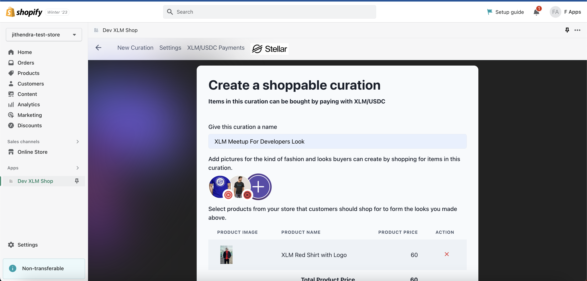

## XLM Shop Dashboard

XLM Shop is a all-in-one Shopify app for merchants for payments and to borrow finances from peers against store performance on XLM

## Demo

[Screencapture demo on Youtube]()

## To get started the Shopify merchant will have to add their XLM public address within their Shopify dashboard.

<tabnle>
<tr>
<td></td>
</tr>

The merchant address is validated using the `StellarSDK` via `Formik`

```
|- src
    |-- routes
        | -- settings
    |-- store
        | -- wallet-store
```

```javascript
import StellarSdk from "stellar-sdk";
const isValidKey = StellarSdk.StrKey.isValidEd25519PublicKey(walletAddress);
```

## Dynamically load Horizon api from ENV to Context as a provider

```
|- src
    |-- context
        | -- index.js
    |-- index.js
```

```javascript
import React from "react";
export const ShopContext = React.createContext();
export const StellarHorizonAPIContext = React.createContext();
```

```javascript
<StellarHorizonAPIContext.Provider
  value={process.env.REACT_APP_STELLAR_HORIZON_API_NETWORK}
>
  <ShopContext.Provider value={shop}>
    <AppRoutes />
  </ShopContext.Provider>
</StellarHorizonAPIContext.Provider>
```

## Creating curation To Shop

<tabnle>
<tr>
<td></td>
<td></td>

</tr>
</table>
```
|- src
    |-- routes
        |-- look
```

- Add Curation name
- Add medias to your curation - on click of add media to look will open the popup - you can drag and drop imagges to upload, once click on upload following codes will be send API request to upload files
<tabnle>
<tr>
<td></td>
</tr>
</table>

```javascript
const files = useFilesStore((state) => state.files);

const onUploadWidgetClose = (data = []) => {
  setUploads([...uploads, ...data]);
  onClose();
};
```

```
|- src
    |-- store
        |-- files
```

```javascript
const base64s = await Promise.all(
  uploads.map(async (upload) => {
    return {
      data: await getBase64(upload),
      type: upload.type,
    };
  })
);
const savedFiles = await Promise.all(
  base64s.map(async (base64) => {
    const parseFile = new Parse.File(
      "looks",
      { base64: base64.data },
      base64.type
    );
    // const savedFile = await parseFile.save();
    const { data } = await axios.post(
      `${process.env.REACT_APP_API_SERVER_URL}/parse/files/looks`,
      {
        base64: parseFile?._source?.base64 || parseFile._data,
        _ApplicationId: Parse.applicationId,
        _ClientVersion: "js3.4.1",
        _ContentType: parseFile?._source?.type,
        _JavaScriptKey: Parse.javaScriptKey,
        fileData: { metadata: {}, tags: {} },
      },
      {
        headers: {
          "content-type": "text/plain",
        },
      }
    );
    return data;
  })
);
```

- Link Product to Curation
  - Products from the Shopify will be fetched throug [Shopify app bridge](https://www.npmjs.com/package/@shopify/app-bridge-react).

<table>
<tr>
<td></td>
</tr>
</table>

- once the products are selected product total valus will be calculated

```javascript
const [products, setProducts] = useState(props.looks.products || []);

let productSum = 0;
const result = data.selection.reduce((p, n) => {
  productSum = p + parseFloat(n.variants[0].price);
  return productSum;
}, 0);
setTotlaProductsPrice(result);
```

- Adding discount price for the curation in USD and calculating XLM value in real time.

```
|- src
    |-- store
        |-- currency-exchage

const response = await axios.get('https://api.coingecko.com/api/v3/simple/price?ids=usd&vs_currencies=xlm')
```

- set the XLM value to 0 initially, and calculate the the XLM price
<table>
<tr>
<td></td>
</tr>
</table>

```javascript
const [exchangeRate, setExchageRate] = useState();

const getExchangeRate = (data) => {
  console.log(data);
  setCurationXLMPrice(
    (currencyExchangeState.get.success.data.xlm * data).toFixed(2)
  );
};
```

- Saving the curation
  - parse the data to save the look

```javascript
await postCuration({
  name: looksName,
  price: looksPrice,
  xlmPrice: lookxlmPrice,
  medias: uploads,
  products: products.map((product) => product.id),
});

const { data } = await axios.post(
  `${process.env.REACT_APP_API_SERVER_URL}/api/post_looks`,
  {
    shop,
    name,
    price,
    xlmPrice,
    medias,
    products,
  }
);
```

- Displaying the curation data

```
|- src
    |-- routes
        |-- look.js
```

## Display Looks using the API

<table>
<tr>
<td></td>
</tr>
</table>

## Display all XLM account payment transactions for the Shopify merchants account in their dashbaord.

<table>
<tr>
<td>

</td>
</tr>
</table>

- Parse the Wallet address to API to get the transaction details

```javascript
try {
  const server = new StellarSdk.Server(stellarHorizonAPI);
  const { data: { walletAddress = "" } = {} } = await axios.get(
    `${process.env.REACT_APP_API_SERVER_URL}/api/get_shop?shop=${shop}`
  );
  const payments = server.payments().forAccount(walletAddress);
  const paymentRecords = await payments.call();
  set(
    produce((state) => ({
      ...state,
      transactionState: {
        ...state.transactionState,
        get: {
          ...INITIAL_TRANSACTION_STATE.get,
          success: {
            ok: true,
            data: paymentRecords,
          },
        },
      },
    }))
  );
} catch (e) {}
```

## Embed Widget to display in frontend

<table>
<tr>
<td></td>
</tr>
</table>

```javascript
const enableWidget = async () => {
  try {
    await postScripts(shop);
    toast({
      title: `Widget added successfully! Please visit your online store after 30 seconds to check the widget.`,
      status: "success",
    });
    getScripts(shop);
  } catch (e) {
    toast({
      title: e.message || INTERNAL_SERVER_ERROR,
      status: "error",
    });
  }
};

const { data } = await axios.post(
  `${process.env.REACT_APP_API__SERVER_URL}/api/post_scripts`,
  { shop }
);
```
